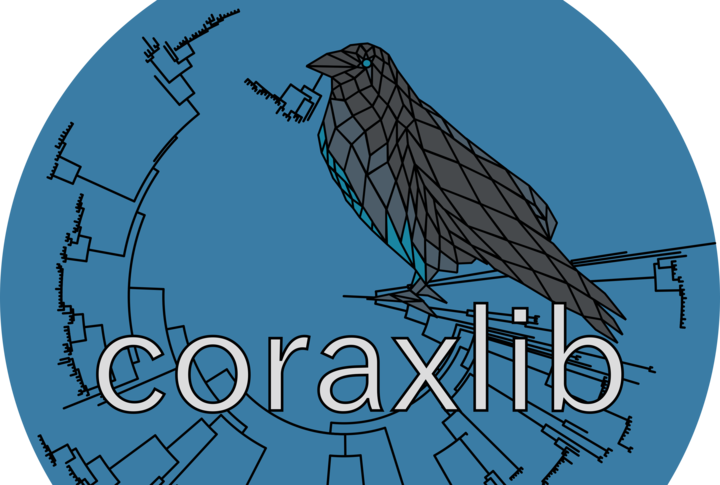

# coraxlib



`coraxlib` (COre RAXml LIBrary) encapsulates common routines used by likelihood-based
phylogenetic software such as [raxml-ng](https://github.com/amkozlov/raxml-ng). 
It will eventually supersede both [libpll-2](https://github.com/xflouris/libpll-2)
 and [pll-modules](https://github.com/ddarriba/pll-modules).

Please read the wiki for more information.

# Compilation instructions

Please make sure you have CMake 3.0.2 or later installed on your system.

Then, use following commands to clone and build `coraxlib`:

```bash
git clone https://codeberg.org/Exelixis-Lab/coraxlib.git
cd coraxlib
mkdir -p build && cd build
cmake ..
make
```

If you want to install `coraxlib` system-wide, please run:

```
sudo make install
```

The library will be installed on the operating system's standard paths.  For
some GNU/Linux distributions it might be necessary to add that standard path
(typically `/usr/local/lib`) to `/etc/ld.so.conf` and run `ldconfig`.

# Developing with coraxlib

Please see the docs [here](docs/libpll.md)

# coraxlib license and third party licenses

The coraxlib code is currently licensed under the
[GNU Affero General Public License version 3](http://www.gnu.org/licenses/agpl-3.0.en.html).
Please see LICENSE.txt for details.

coraxlib includes code from several other projects. We would like to thank the
authors for making their source code available.

coraxlib includes code from GNU Compiler Collection distributed under the GNU
General Public License.
